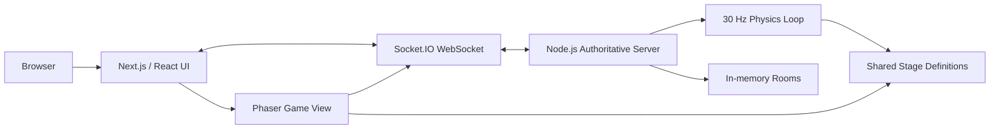
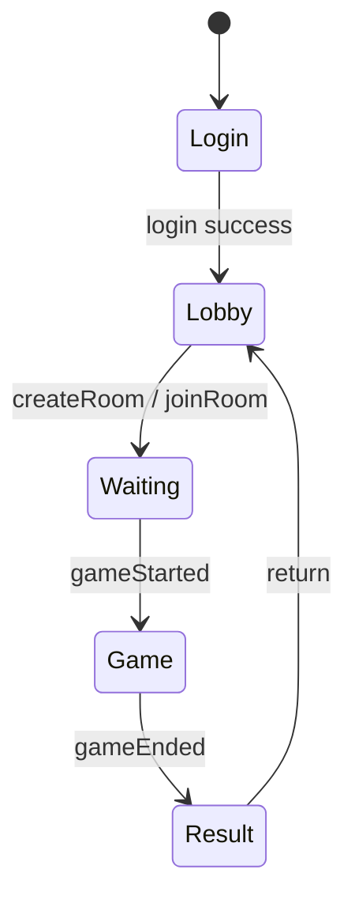

# Sky Rush システム設計書

- 対象バージョン: v1.1
- 更新日: 2026-09-14
- 本文書の基準: 現在のソースコード

## 1. 設計概要

Sky Rushは、Next.jsの画面とPhaserのゲーム描画を、Node.js上のSocket.IO権威サーバーへ接続する構成です。プレイヤー入力だけをクライアントから送り、位置、速度、衝突、足場状態、順位、終了判定はサーバー側で計算します。



## 2. 技術スタック

| 分類 | 技術 |
| --- | --- |
| UI | Next.js 14、React 18 |
| ゲーム描画 | Phaser 3 |
| リアルタイム通信 | Socket.IO、WebSocket固定 |
| サーバー | Node.js、Next.jsカスタムHTTPサーバー |
| 言語 | TypeScript |
| コンテナ | Docker |
| AWS | ECR、ECS Fargate、ALB、CloudFormation |

## 3. ディレクトリ構成

| パス | 責務 |
| --- | --- |
| `pages/index.tsx` | ログイン、ロビー、待機、ゲームHUD、観戦、結果画面 |
| `src/SkyRushGame.tsx` | Phaserシーン、キャラクター・足場描画、PC/スマホ入力 |
| `server/index.ts` | Socket.IO、ルーム管理、物理、CPU、終了判定、再接続 |
| `shared/types.ts` | クライアント・サーバー間の共有型とイベント契約 |
| `shared/stage-layout.ts` | ステージ定義、足場アニメーション、コース境界、到達性検査 |
| `scripts/check-stages.ts` | 全ステージの静的検査 |
| `scripts/render-stage-preview.ts` | ステージプレビューHTML/SVG生成 |
| `scripts/load-test-cpu20.ts` | 2～20人のCPU負荷・進行テスト |
| `infra/cloudformation.yml` | ECS、ALB、ネットワーク、ログ等のAWS構成 |
| `scripts/deploy-ecs.ps1` | ECRビルド・プッシュとCloudFormationデプロイ |

## 4. 実行構成

### 4.1 開発時

```text
npm.cmd run dev
  -> tsx watch server/index.ts
  -> Next.js development server
  -> Socket.IO server
  -> http://localhost:3000
```

### 4.2 本番時

```text
npm.cmd run build
  -> next build
  -> tsc -p tsconfig.server.json

npm.cmd start
  -> node dist-server/server/index.js
  -> Next.js production assets + Socket.IO
```

## 5. クライアント状態

画面状態は次の5種類です。



Reactが管理する主な状態:

- 接続状態
- ログイン情報
- 部屋一覧
- 現在のルームスナップショット
- 画面状態
- 通知
- 観戦対象
- 部屋作成条件

PhaserはReactから最新の`RoomState`を参照し、サーバー座標を描画します。クライアント側でプレイヤー位置を確定させる予測処理は行いません。

## 6. Socket.IOイベント

### 6.1 クライアントからサーバー

| イベント | 主な内容 | 用途 |
| --- | --- | --- |
| `login` | プレイヤー名、パスコード、セッションID | 認証と再接続 |
| `listRooms` | なし | 部屋一覧取得 |
| `createRoom` | 部屋名、モード、難易度、人数、ステージ | 部屋作成 |
| `joinRoom` | 部屋ID | 部屋参加 |
| `leaveRoom` | なし | 退出 |
| `startGame` | なし | ホストによる開始 |
| `setTeam` | チーム番号 | 開始前のチーム変更 |
| `setColor` | カラー | 開始前の色変更 |
| `input` | 左右、ジャンプ状態、チャージ、連番 | プレイヤー操作 |

### 6.2 サーバーからクライアント

| イベント | 主な内容 | 用途 |
| --- | --- | --- |
| `rooms` | `RoomSummary[]` | ロビー更新 |
| `roomState` | `RoomState` | 待機状態更新 |
| `gameStarted` | `RoomState` | ゲーム画面へ遷移 |
| `gameState` | `RoomState` | ゲーム中の同期 |
| `gameEnded` | ルーム、結果一覧 | 結果画面へ遷移 |
| `effectBurst` | 種類、座標 | 押し出し・ジャンプ演出 |
| `errorMessage` | メッセージ | エラー通知 |

## 7. 通信設計

- Socket.IOのtransportは`websocket`に固定します。
- クライアント入力は最大約20Hz、50ms間隔で送信します。
- 入力変化またはジャンプ要求がある場合は、不要な待機を避けて送信します。
- 入力には`seq`を付与し、古い入力による巻き戻りを防止します。
- ジャンプ要求には`jumpRequestId`を付与し、同じジャンプの重複実行を防止します。
- サーバーは30Hzで物理計算し、各tickで`gameState`を送信します。
- `serverTime`を使って足場アニメーションとカウントダウンをサーバー時刻へ同期します。

## 8. サーバー権威モデル

サーバーが次の状態を保持・更新します。

- プレイヤー位置と速度
- 接地、壁接触、乗っているプレイヤーまたは足場
- 入力状態
- ジャンプチャージ
- 足場の現在形状と有効状態
- プレイヤー同士の押し合い
- 高度、ゴール、順位
- ルーム開始・終了・タイムアウト

クライアントは入力を送信し、受信した状態を描画します。このため、通常のクライアント改変だけでは座標やゴール判定を直接変更できません。

## 9. 物理設計

主要定数:

| 定数 | 値 |
| --- | ---: |
| ワールド幅 | 2200 |
| 重力 | 2100 |
| 横移動速度 | 360 |
| 最小ジャンプ力 | 900 |
| 最大ジャンプ力 | 1360 |
| プレイヤー幅 | 34 |
| プレイヤー高さ | 46 |
| 最大チャージ | 650ms |

ジャンプ力:

```text
jumpPower = min(jumpMax, jumpMin + min(chargeMs, 650) * 0.8)
```

補正:

- 味方の上からジャンプ: `1.38`倍
- 他プレイヤーの上からジャンプ: `1.08`倍
- 最終ジャンプ力は安全上限で制限

各tickの概略順序:

1. カウントダウン判定
2. 足場の現在状態を算出
3. CPU入力を生成
4. 移動床に乗っているプレイヤーを床移動量だけ運ぶ
5. 左右速度とジャンプを適用
6. 重力と座標を更新
7. コース境界を適用
8. 足場上面・下面との衝突を解決
9. プレイヤー上への着地を解決
10. 落下復帰、高度、ゴールを更新
11. プレイヤー同士の押し合いを3回反復解決
12. 終了条件を判定して状態配信

## 10. 足場設計

`Platform`は位置・サイズと、種類別の任意パラメーターを持ちます。

| 種類 | 使用パラメーター | 算出方法 |
| --- | --- | --- |
| 通常 | `x`, `y`, `w`, `h` | 固定 |
| 伸縮 | `minW`, `maxW`, `periodMs`, `phaseMs` | cosine補間で幅を往復 |
| 消える | `visibleMs`, `hiddenMs`, `phaseMs` | 周期内の経過時間で`active`を切替 |
| 移動 | `minX`, `maxX`, `periodMs`, `phaseMs` | cosine補間でX座標を往復 |

`currentPlatform(platform, now)`をクライアント描画、サーバー衝突、CPU予測で共用し、同じ時刻に同じ形状を得る設計です。

## 11. ステージ生成と検査

ステージは`StageId`ごとの関数で明示的に配置します。足場幅、消失周期、伸縮周期、移動周期はプリセットを優先して使用します。

`npm.cmd run check:stages`は次を検査します。

- ゴール前安全帯に妨害床がないこと
- 足場が高度ごとのコース境界からはみ出さないこと
- 1画面相当の範囲に足場が過密配置されていないこと
- スタートからゴールまでジャンプ可能な経路があること
- 真上被りの場合に、踏切として使える横方向の露出があること
- 移動床が4枚以下の場合、左・中央・右の全組み合わせで到達可能なこと
- 移動床が5枚以上の場合、全左・全中央・全右の代表状態で到達可能なこと

検査は静的な到達可能性を保証しますが、実プレイ上の難易度や消える床同士の体感タイミングは別途プレイテストします。

## 12. CPU設計

### 12.1 共通

- 開始時に不足人数を最大20人まで補います。
- 奇数番号を弱CPU、偶数番号を強CPUとします。
- CPUごとに小さな技能値と判断誤差を持たせます。
- CPUキャラクターはグレーで表示します。

### 12.2 弱CPU

- 現在地から一定高度内にある足場を抽出します。
- 横距離と中央寄りの傾向から、近い足場を1枚選びます。
- 一定距離まで寄るとジャンプします。
- 移動床の未来位置、消える床の着地時刻、次の足場は評価しません。

### 12.3 強CPU

強CPUは次の手順で行動します。

1. ジャンプ可能な次の足場候補を列挙する。
2. チャージ量から上昇通過時刻と着地時刻を算出する。
3. 着地時刻の移動床位置と伸縮床幅を予測する。
4. 消える床が着地後220ms以上残る候補だけを採用する。
5. 候補からさらに次の1段へ進めるかを評価する。
6. 上段の下面へ衝突しない左右の離陸点を選ぶ。
7. 上段を越えるまでは離陸ラインを維持し、その後に着地点へ操舵する。
8. 移動床に対しては飛行中も着地予測位置を更新する。

計算量を抑えるため、探索は2段先までとし、永続的な経路キャッシュは持ちません。

## 13. ルームライフサイクル

- ルームは`Map<string, RoomRuntime>`でプロセスメモリに保持します。
- 開始前の退出はプレイヤーを即時削除します。
- 試合中の切断はプレイヤーをオフライン状態で残します。
- 切断プレイヤーは2分後に削除します。
- 人間プレイヤーが0人の部屋は削除します。
- 全員切断した終了済み部屋は一定時間後に削除します。
- ホスト切断時は別の人間プレイヤーへ所有権を移します。

## 14. 再接続

1. ログイン成功時にサーバーがセッションIDを発行する。
2. クライアントが`sessionStorage`へ保存する。
3. Socket.IO再接続後、同じセッションIDで`login`する。
4. サーバーが切断状態の人間プレイヤーを探索する。
5. 新しいSocket IDへプレイヤー状態とホスト権限を移す。

セッションIDは認証トークンではなく、短時間の試合復帰識別子です。

## 15. 終了・観戦設計

- ゴールしたプレイヤーはサーバー側で速度と操作を停止します。
- 人間プレイヤー全員の`finishedAt`設定、または`timeoutAt`到達で終了します。
- CPUは終了条件の「全員」判定から除外します。
- ゴール済み人間プレイヤーのクライアントは、未ゴールプレイヤーをカメラ対象にします。
- 観戦対象の変更はクライアント表示のみで、ゲーム状態へ影響しません。

## 16. デプロイ設計

標準フロー:

1. GitコミットSHAを取得する。
2. Dockerイメージをビルドする。
3. ECRへコミットSHAタグでプッシュする。
4. CloudFormationへイメージURIを渡す。
5. ECS Fargateサービスを更新する。
6. ALBのURLとデプロイ時刻を出力する。

アプリケーションはHTTPとWebSocketを同一ポートで待ち受けます。詳細は[運用手順](OPERATIONS.md)を参照してください。

## 17. スケーリング上の制約

現在のルーム状態はプロセスメモリ内にあるため、ECSサービスを単純に複数タスク化すると次の問題が発生します。

- 同じ部屋の参加者が別タスクへ接続する
- 別タスクからルーム一覧が見えない
- 再接続先が変わると試合へ復帰できない

複数タスク化する場合の候補:

- ALBスティッキーセッション
- Redis等による共有ルーム状態
- Socket.IO Redis adapterによるイベント共有
- 部屋単位の明示的なルーティング

200人規模のイベントでは、1試合20人を維持して複数試合に分ける場合でも、同時開催数とECSタスク構成を事前に負荷検証する必要があります。

## 18. 品質保証

変更後の基本コマンド:

```powershell
npm.cmd run typecheck
npm.cmd run lint
npm.cmd run check:stages
npx.cmd tsc -p tsconfig.server.json
npm.cmd run build
```

CPU負荷テスト:

```powershell
$env:SKY_RUSH_URL="http://127.0.0.1:3000"
$env:SKY_RUSH_STAGE_ID="battle_03_cloud_jumble"
$env:SKY_RUSH_LOAD_TEST_MS="45000"
$env:SKY_RUSH_LOAD_PLAYERS="20"
npm.cmd run test:cpu20
```

任意で`SKY_RUSH_TRACE_CPU=1`を設定すると、CPUの高度・座標・速度を1秒ごとに出力します。

## 19. 未実装・今後の設計課題

- プレイ履歴、参加者、勝敗の永続ログ
- 管理者向けの大会進行画面
- ルームの予約・組み合わせ管理
- 複数ECSタスク間の状態共有
- ユーザー認証と権限管理
- 自動デプロイとロールバック
- CPU比率・強さの部屋設定UI
- HARDの物理的難易度差

## 20. 関連文書

- [ゲーム仕様書](GAME_SPEC.md)
- [運用手順](OPERATIONS.md)
- [README](../README.md)
